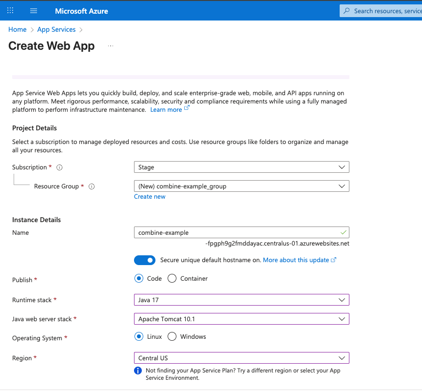
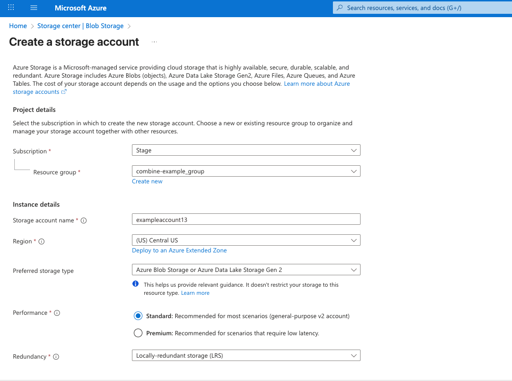
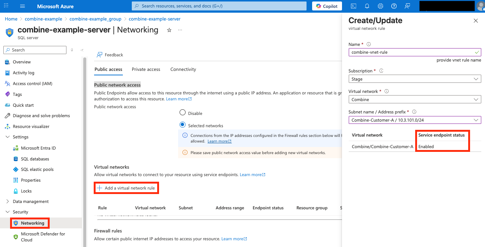
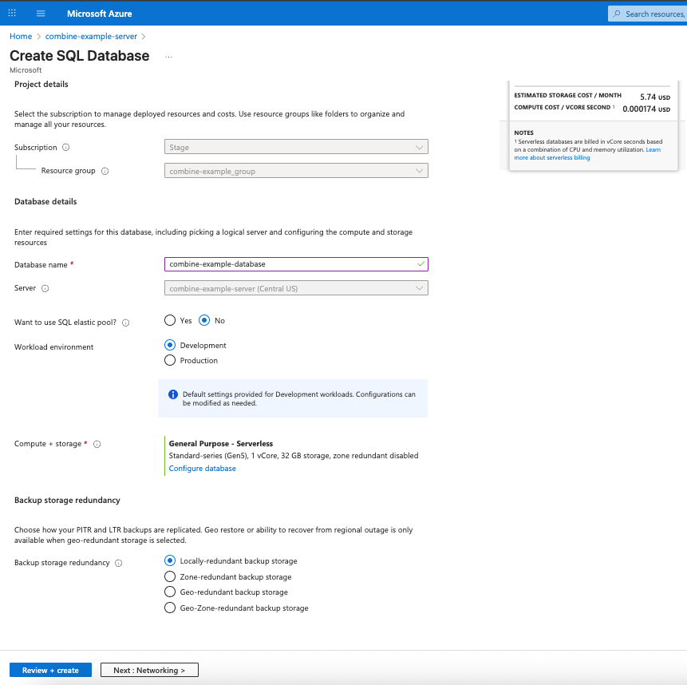
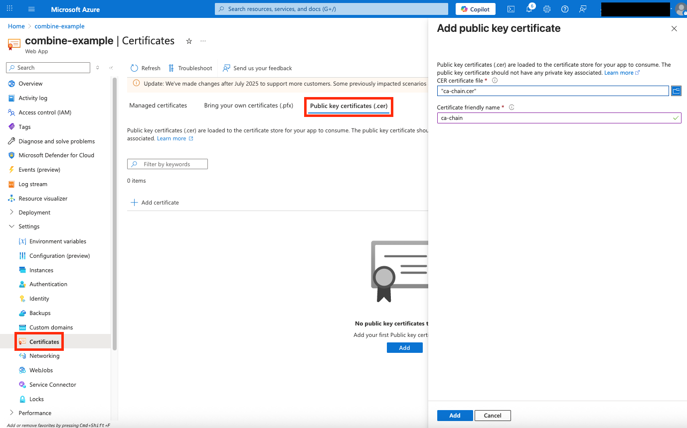
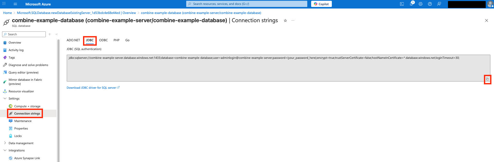
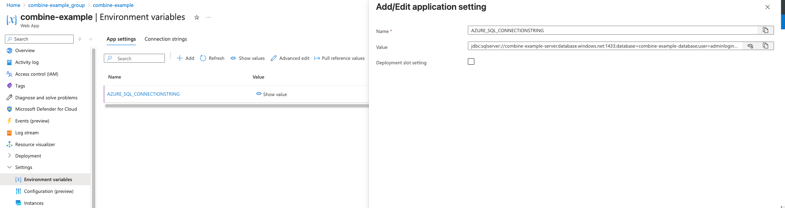
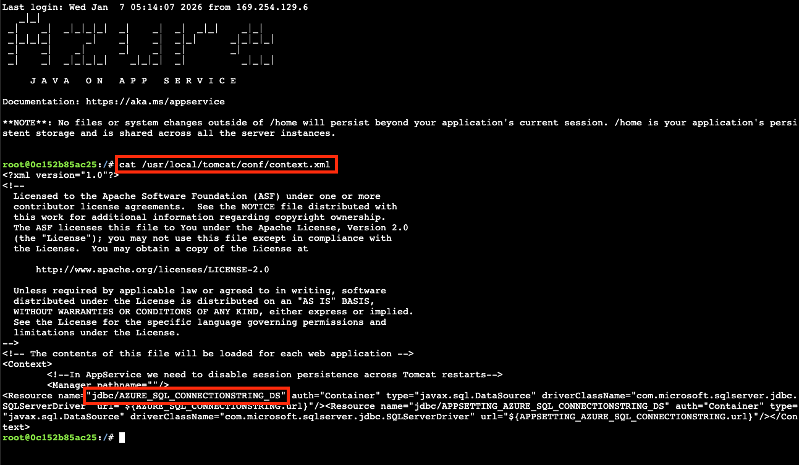

# Sequoia Combine Azure Java SDK Example
**Java (Tomcat 10.1) + Azure SQL + Blob Storage**

This guide walks you through provisioning the **Azure resources** required to deploy a **Java 17 / Tomcat 10.1** web app inside **Combine Azure**.

> **Goal**: Stand up the infrastructure for a sample workload that uses:
> - Azure App Service (Linux) running Tomcat
> - Azure SQL Database
> - Azure Storage (Blob)
> - (Optional) Azure Key Vault for secrets

## Table of contents
- [What you will provision](#what-you-will-provision)
- [Step 1: Create the Web App](#step-1-create-the-web-app)
- [Step 2: Integrate the Web App with the Combine VNet](#step-2-integrate-the-web-app-with-the-combine-vnet)
- [Step 3: Create Storage Account and Assign Access](#step-3-create-storage-account-and-assign-access)
- [Step 4: Create Azure SQL Server + Database](#step-4-create-azure-sql-server--database)
- [Step 5: Upload Combine CA chain to App Service](#step-5-upload-combine-ca-chain-to-app-service)
- [Step 6: Configure Web App environment variables](#step-6-configure-web-app-environment-variables)
- [Step 7: Verify the Tomcat JNDI data source](#step-7-verify-the-tomcat-jndi-data-source)
- [Optional: Use Key Vault for the JDBC connection string](#optional-use-key-vault-for-the-jdbc-connection-string)
- [Step 8: Deploy the application](#step-8-deploy-the-application)
- [Quick verification checklist](#quick-verification-checklist)


## What you will provision
- Resource group
- App Service plan (Linux, **Basic or higher**)
- Web App (Java 17 + Tomcat 10.1) with system-assigned managed identity
- Storage account with Blob container
- Azure SQL Server and Database
- (Optional) Azure Key Vault


## Step 1: Create the Web App

Create the Web App first so its **resource group** can be reused.


1. Azure Portal → **App Services** → **Create** → **Web App**
2. **Project details**
   - **Subscription:** your choice
   - **Resource group:** Create new
3. **Instance details**
   - **Publish:** `Code`
   - **Runtime stack:** `Java 17`
   - **Java web server:** `Apache Tomcat 10.1`
   - **OS:** `Linux`
   - **Region:** your choice
4. **Pricing plan**
   - **Basic (B1) or higher** (required for VNet Integration)
5. **Review + create** → **Create**

Leave the Web App open for the next steps.


## Step 2: Integrate the Web App with the Combine VNet

1. Web App → **Networking**
2. Under **VNet Integration**, select **Add VNet integration**
3. Choose:
   - **Virtual network:** Combine
   - **Subnet:** one of the `Combine-Customer-*` subnets
4. Save the configuration

> **Note:** This subnet selection **must match** what you later configure on Azure SQL.


## Step 3: Create Storage Account and Assign Access



1. Azure Portal → **Storage accounts** → **Create**
2. **Basics**
  - **Resource group:** same as Web App
  - **Performance:** `Standard`
  - **Redundancy:** `LRS`
  - **Networking:** leave defaults
3. **Review + create** → **Create**

4. After creation, open the Storage Account:
  - **Containers** → **+ Container** → Create a new Blob container (e.g., `background-images`)
  - Confirm **Secure transfer required** is **On (HTTPS only)** and **Minimum TLS version** is **1.2**
  - Record the Blob endpoint for later use

5. Grant access to the Web App's managed identity:
  - Storage Account → **Access Control (IAM)**
  - **Add role assignment**
    - **Role:** Storage Blob Data Contributor
    - **Assign access to:** Managed identity
    - **Member:** your Web App
  - Save


## Step 4: Create Azure SQL Server + Database

### 4.1 Create the SQL Server

1. Azure Portal → **SQL servers** → **Create**
2. Configure:
   - **Resource group:** same as Web App
   - **Authentication:** SQL authentication
   - Set admin login + password
3. Networking:
   - Enable public access initially
   - Allow Azure services (0.0.0.0 rule)
4. **Review + create**


### 4.2 Configure SQL networking (Selected networks)



1. SQL Server → **Security** → **Networking**
2. Set **Public network access** to **Selected networks**
3. Add a **Virtual network rule**
   - **VNet:** Combine
   - **Subnet:** same `Combine-Customer-*` subnet used by the Web App from earlier
     - Enable service endpoint `Microsoft.Sql` if not already enabled


### 4.3 Create the Database



- SQL Server → **Databases** → **Create database**
- **Compute and storage:** General Purpose + Serverless
- **Backup storage redundancy:** Locally-redundant backup storage
- Create the database


## Step 5: Upload Combine CA chain to App Service

> Adding Combine's client certificate to App Service allows the application to make Azure API calls to the target region's endpoints through Combine.



1. Web App → **Settings** → **Certificates**
2. Under **Public key certificates (.cer)**:
   - Upload your Combine CA chain
   - Convert `.crt` → `.cer` if required


## Step 6: Configure Web App environment variables

> **Note:** In production, avoid storing sensitive values like `AZURE_SQL_CONNECTIONSTRING` directly in App Settings. The recommended approach is to store the connection string in Azure Key Vault and reference it via Key Vault references. For step-by-step instructions, see [Optional: Use Key Vault for the JDBC connection string](#optional-use-key-vault-for-the-jdbc-connection-string) below. For the most accurate guidance, refer to Azure documentation. For this tutorial, entering the value directly in App Settings is acceptable.

### Retrieve the JDBC connection string


- SQL Database → **Connection strings** → **JDBC**
- Replace `{your_password_here}` with your SQL password

### Add App Settings


Web App → **Environment variables** → **Application settings**

| Name | Value |
|-----|------|
| `BACKGROUND_STORAGE_ENDPOINT` | `https://<your-storage-account>.blob.core.scombine.scloud` |
| `AZURE_SQL_CONNECTIONSTRING` | JDBC connection string |
| `WEBSITE_AUTOCONFIGURE_DATABASE` | `true` |

Save the settings.

> **Endpoint Behavior:** In this example, the Azure SQL Database connection string uses the standard commercial endpoint because the SQL endpoint suffix is identical in both Commercial and Secret environments, so no endpoint rewriting is required. In contrast, Azure Blob Storage endpoints differ. Commercial uses `*.core.windows.net`, while Secret uses an endpoint suffix similar to `*.core.scombine.scloud`, meaning the Blob endpoints in this example must align with the Secret endpoint suffix format.

## Optional: Use Key Vault for the JDBC connection string

Use this path to follow best practice for secrets management (rotation, RBAC, auditing):

1) **Create the Key Vault**
   - In **Resource Group**, select your resource group.
   - In **Key vault name**, type a name that consists of only letters and numbers.
   - In **Region**, set it to the same location as the resource group.

2) **Create the secret**
   - **Secret name:** your choice
   - **Value:** the JDBC connection string

3) **Grant the Web App access**
   - **Role:** Key Vault Secrets User
   - **Member:** the Web App system-assigned managed identity

4) **Reference the secret in App Settings**
   Set `AZURE_SQL_CONNECTIONSTRING` to:

   ```text
   @Microsoft.KeyVault(SecretUri=<your-secret-uri>)
   ```

## Step 7: Verify the Tomcat JNDI data source
> If you add an app setting that contains a valid JDBC connection string, App Service adds a _Java Naming and Directory Interface (JNDI)_ data source for it in the Tomcat server's `context.xml` file. In this step, you use the SSH connection to the app container to verify the JNDI data source.



1. Web App → **Development Tools** → **SSH**
2. Run:
   ```bash
   cat /usr/local/tomcat/conf/context.xml
3. Confirm a resource named:
   ```bash
   jdbc/AZURE_SQL_CONNECTIONSTRING_DS
   ```


## Step 8: Deploy the application
- Web App → **Deployment** → **Deployment Center**
- Deploy your app as `target/ROOT.war`
