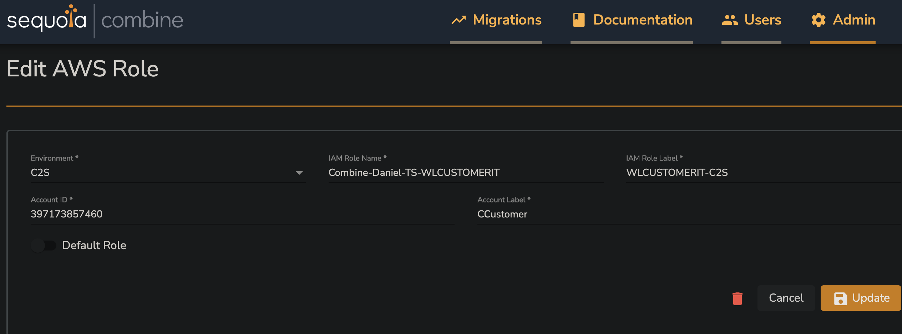
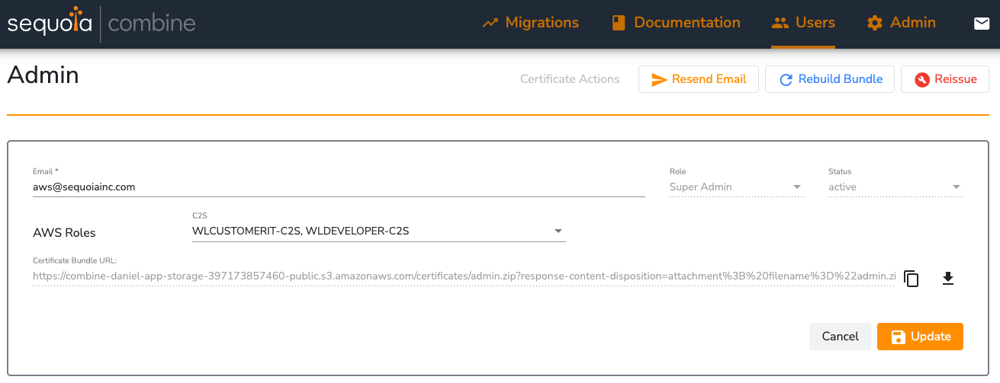
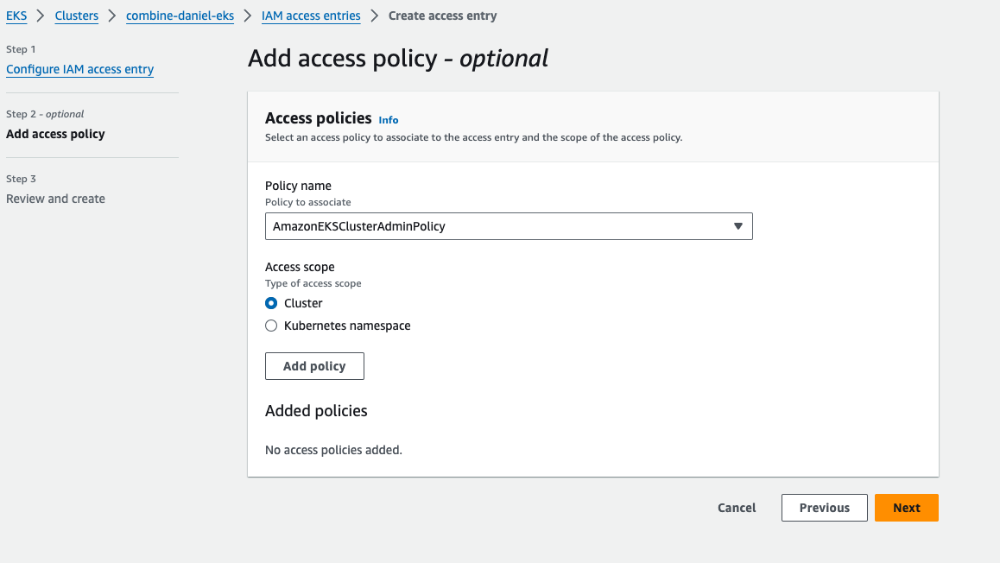

## Sequoia Combine EKS Terraform Documentation

This repository is the Combine Team's working sample code for the provisioning of an EKS cluster within a Combine environment.

----------
### Overview and Notices

- This repository uses [terragrunt](http://terragrunt.gruntwork.io/) and [helm](https://helm.sh/).

- There is a script that installs terragrunt, helm and several kube binaries in the `user_data` of the `aws_instance` resource in the [`bastion` module in this repo](modules/bastion/main.tf).

- Note that if you are provisioning the cluster within Combine, you do not need to provision the bastion. The Combine Proxy already functions as a Bastion, so you can simply copy and paste the script into the Combine Proxy. Note that in this case you don't need either the `bastion` or the `networking` module.

----------
### Directory Structure

As with any interaction with the AWS APIs within Combine, you'll need to import the Combine CA into your bastion/proxy instance to provision the infrastructure; see Combine TAP Dashboard documentation on how to do this.

The terraform modules live in the `/modules` directory. You will not have to touch the `/modules` directory at all, as the terragrunt code in `/terragrunt/<your-cluster-name>` hydrates the modules. Note that there is a one-to-one relationship between the directories in `/combine-example` and the module directories.

----------
### Before You Provision

Please take note of this section; every paragraph represents an action that needs to be taken for the provisioning to work properly.

The following parameters should be enabled in your `Combine-Policy` cloudformation stack - `EnableRoleHierarchyC2E`, `EnableRoleHierarchyC2EPermissionBoundary`, `EnableRoleHierarchyC2ESelfService`. You can update the existing stack and change just those three parameters. A Combine team member can also do this for you.

Before provisioning, you'll need to replace some values in the `env.hcl` in your copy of `/combine-example`, as well as in every other `terragrunt.hcl` file inside it. Look out particularly for the ARNs in each file - we have made them obvious by using the invalid AWS Account id `123456789012`. The VPC id and subnets in `eks-cluster/terragrunt.hcl` will need to be replaced with the ones in your Combine network.

Publicly-available Plugin images should be cached in your own ECR. This includes the `aws_loadbalancer_controller_image` and the `ebs_csi_driver_image`.

We are currently using another role in tandem with `WLDEVELOPER` that emulates a third-party customer team, named `WLCUSTOMERIT`, that is responsible for creating OIDC providers. Here are the steps to create this role:
- in IAM, create a role named `Combine-YourName-TS-WLCUSTOMERIT` with the following permissions:

```
{
    "Version": "2012-10-17",
    "Statement": [
        {
            "Effect": "Allow",
            "Action": [
                "iam:CreateOpenIDConnectProvider",
                "iam:GetOpenIDConnectProvider",
                "iam:UpdateOpenIDConnectProviderThumbprint",
                "iam:DeleteOpenIDConnectProvider",
                "iam:ListOpenIDConnectProviders",
                "iam:TagOpenIDConnectProvider",
                "eks:DescribeCluster"
            ],
            "Resource": "*"
        }
    ]
}
```

and the following trust policy:
```
{
    "Version": "2012-10-17",
    "Statement": [
        {
            "Effect": "Allow",
            "Principal": {
                "AWS": "arn:aws:iam::123456789012:root"
            },
            "Action": "sts:AssumeRole"
        }
    ]
}
```
- Then, map it to the WLCUSTOMERIT-C2S role via the Combine Tap Dashboard like so: 



- Ensure that the Role name and label are as they are in the above screenshot, save the 'Daniel' in the role name should be replaced with your own name.

You'll then need to associate your user with the `WLCUSTOMERIT-C2S` and the `WLDEVELOPER-C2S` roles via the Combine TAP Dashboard, like so (shown here for the Admin user):


In the Proxy's ` ~/.aws/credentials` file, you'll need a WLDEVELOPER and WLCUSTOMERIT profile in your file. Instructions on how to populate the profile can be found in the Combine Dashboard documentation. Remember that the tokens expire every hour by default, but this is configurable in the Combine Dashboard. A sample credentials file would look like:

```
[WLDEVELOPER]
region                = us-iso-east-1
aws_access_key_id     = ACCESS_KEY_ID
aws_secret_access_key = SECRET_ACCESS_KEY
aws_session_token     = <token>
aws_token_expiration  = 2024-09-18T18:00:01Z

[WLCUSTOMERIT]
region                = us-iso-east-1
aws_access_key_id     = ACCESS_KEY_ID
aws_secret_access_key = SECRET_ACCESS_KEY
aws_session_token     = <token>
aws_token_expiration  = 2024-09-18T18:00:01Z
```

### Provisioning the Cluster

In order to provision your own cluster:
- copy the `/combine-example` directory into an adjacent directory (directly under `/terragrunt`),
- change the values in your `env.hcl` and each module's `terragrunt.hcl`,
- `cd` into the `/eks_cluster` directory and run `terragrunt apply`.

- Once the cluster has been created, you'll need to create an IAM Access entry mapping your WLDeveloper user to the policy AmazonEKSClusterAdminPolicy.

 d
- `cd` back into the root of your environment's directory, and run `terragrunt run-all apply`.

If you have taken the above steps, your provisioning should go smoothly and you will be able to interact with the cluster:
```
kubectl get ns
NAME              STATUS   AGE
default           Active   23h
kube-node-lease   Active   23h
kube-public       Active   23h
kube-system       Active   23h
```

-----------
### Caveats/Notes
- If a customer wants to pull docker images directly through combine, they will need to add the combine ca chain to their nodes; a temporary workaround would be to whitelist the public ecr endpoint in the proxy. This is already done in this repository via the `pre_bootstrap_user_data - see [this file](modules/eks-cluster/main.tf#L78).

- Ensure that you are using the `aws` cli version 2, as version 1 will fail with a cryptic `Unauthorized` error. The bastion bootstrap will install version 2.

- It would be a good idea to set `AWS_CA_BUNDLE` and `AWS_PROFILE` in your bash_profile; this is easy to forget if you log out and log back in!

-----------
### Known Issues
- We've seen the `generate "provider_oidc"` block in the `oidc-provider/terragrunt.hcl` misconfigured at times. The symptom is that `.terragrunt/<cache-guid>/provider.tf` has the `WLDEVELOPER` profile instead of the `WLCUSTOMERIT` role in the aws provider block. A `terragrunt destroy` followed by a `terragrunt apply` should fix this.

- We are working on a convenience mechanism for automatically refreshing the credentials, which will remove the need for manually updating the tokens in the credentials file.