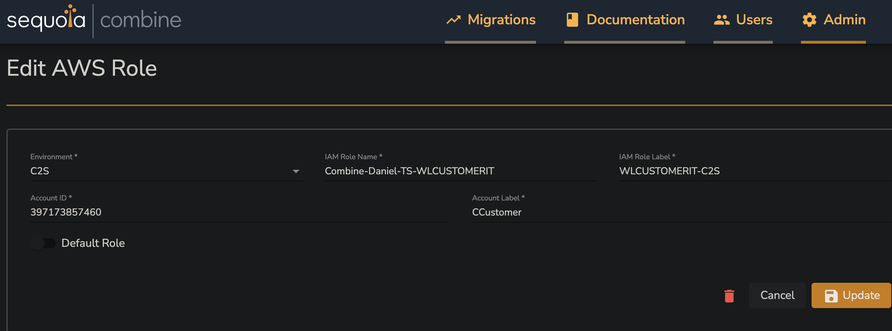
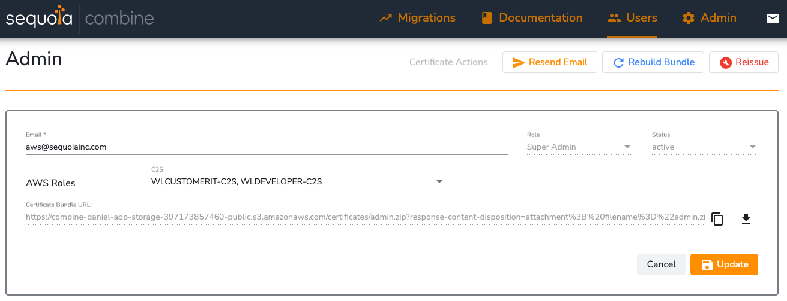
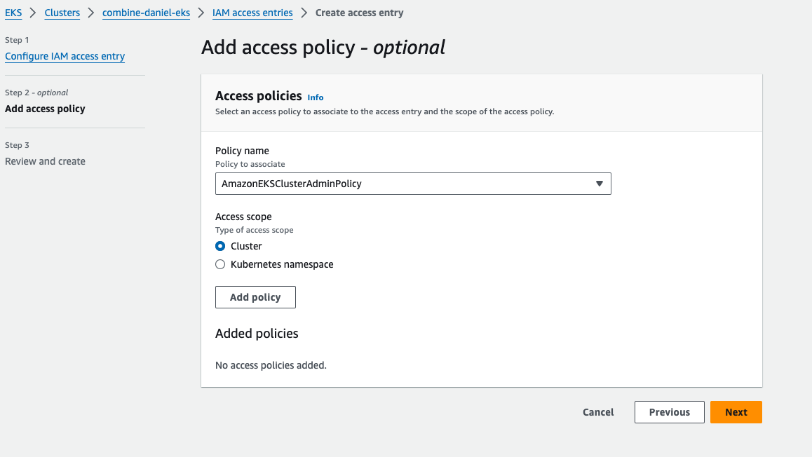

## Sequoia Combine EKS Terraform Documentation

This repository is the Combine Team's working sample code for the provisioning of an EKS cluster within a Combine environment.

----------
### Overview and Notices

- This repository uses [terragrunt](http://terragrunt.gruntwork.io/) and [helm](https://helm.sh/).

- There is a script that installs terragrunt, helm and several kube binaries in the `user_data` of the `aws_instance` resource in the [`bastion` module in this repo](modules/bastion/main.tf).

- This sample code uses the preexisting Combine role arns.

### TL;DR

The tl;dr version of this readme. This is all you need to get the EKS cluster up and running.

From a machine inside the Combine VNet, once you've authenticated to CAP and have created your `~/.aws/credentials` file, like so:


```
[WLDEVELOPER]
region                = us-iso-east-1
aws_access_key_id     = ACCESS_KEY_ID
aws_secret_access_key = SECRET_ACCESS_KEY
aws_session_token     = <token>
aws_token_expiration  = 2024-09-18T18:00:01Z
```

you can run `scripts/install-dependencies.sh`, then `scripts/create-and-deploy-eks.sh` with the VPC id and cluster name:

```
./scripts/create-and-deploy-eks.sh -e my-cluster -v vpc-01234567890123456
```

A few notes:
- For the `install-dependencies.sh` script to work, your Combine firewall will need to be in permissive mode. If you are unsure how to flip this config please reach out to a Combine team member over slack or [email](mailto:service-request@sequoiainc.com).
- For the `create-and-deploy-eks.sh` script to work, your Combine Policy Stack will need the following parameters set to `true`: `EnableRoleHierarchyC2E`, `EnableRoleHierarchyC2EPermissionBoundary` and `EnableRoleHierarchyC2ESelfService`. If you are unsure how to flip this config please reach out to a Combine team member over slack or [email](mailto:service-request@sequoiainc.com).

----------
### Directory Structure

As with any interaction with the AWS APIs within Combine, you'll need to import the Combine CA into your bastion instance to provision the infrastructure; see Combine TAP Dashboard documentation on how to do this.

The terraform modules live in the `/modules` directory. You will not have to touch the `/modules` directory at all, as the terragrunt code in `/terragrunt/<your-cluster-name>` hydrates the modules. Note that there is a one-to-one relationship between the directories in `/combine-example` and the module directories.

#### Modules
| Name                                 | Description                                                                                        |
| :------------------------------------| :--------------------------------------------------------------------------------------------------|
| bastion                              | Creates an EC2 instance configured with the tools needed to deploy Terraform, Terragrunt and Helm. |
| networking                           | Creates a simple network.                                                                          |
| eks-cluster                          | Creates an EKS cluster.                                                                            |
| eks-cluster-v21                      | Creates an EKS cluster in a particular network using v21 of the aws eks terraform module.          |
| eks-cluster-separate-subnets         | Creates an EKS cluster with pods and nodes in separate subnets.                                    |
| eks-cluster-separate-subnets-v21     | Creates an EKS cluster with pods and nodes in separate subnets using v21 of the aws eks terraform module. |
| eks-node-group-separate-subnets      | Creates a managed node group for an EKS cluster with pods and nodes in separate subnets.           |
| eks-node-group-separate-subnets-v21  | Creates a managed node group for an EKS cluster with pods and nodes in separate subnets using v21 of the aws eks terraform module. |
| eks-auth                             | Manages EKS access.                                                                                |
| oidc-provider                        | Creates an OpenId Connect Provider.                                                                |
| plugins                              | Deploys a configurable set of EKS plugins.                                                         |
| test-helm-chart                      | A sample Helm chart for testing cluster deployments.                                               |


----------
### Before You Provision

Please take note of this section; every paragraph represents an action that needs to be taken for the provisioning to work properly.

The following parameters should be enabled in your `Combine-Policy` cloudformation stack - `EnableRoleHierarchyC2E`, `EnableRoleHierarchyC2EPermissionBoundary`, `EnableRoleHierarchyC2ESelfService`. You can update the existing stack and change just those three parameters. A Combine team member can also do this for you.

Before provisioning, you'll need to replace some values in the `env.hcl` in your copy of `/combine-example`, as well as in every other `terragrunt.hcl` file inside it. Each module has the `module/variables.tf` which contains all the variables and their descriptions that you would need in the `terragrunt.hcl` file for that module.

- ca_cert_path - this path is specific to the ca cert chain on the bastion or machine where the terragrunt will be run.
- ARNs - we have made them obvious by using the invalid AWS Account id `123456789012`.
- All roles, permission boundaries and accounts in in `eks-auth/terragrunt.hcl`, `eks-cluseter/terragrunt.hcl` and `oidc-provider/terragrunt.hcl` need to previously exist. In the case of deploying inside combine use the corresponding roles or accounts.
- The VPC id and subnets in `eks-cluster/terragrunt.hcl` will need to be replaced with the ones in your Combine network.
- When using the eks-cluster module you need create an EC2 key and supply the name on the terragrunt for the node_group_remote_access_key.

Publicly-available Plugin images should be cached in your own ECR. This includes the `aws_loadbalancer_controller_image` and the `ebs_csi_driver_image`. The images for the pluggins can be downloaded from:
- [AWS Load balancer Controller](https://gallery.ecr.aws/eks/aws-load-balancer-controller)
- [AWS EBS CSI Driver Image](https://gallery.ecr.aws/ebs-csi-driver/aws-ebs-csi-driver)

We are currently using another role in tandem with `WLDEVELOPER` that emulates a third-party customer team, named `WLCUSTOMERIT`, that is responsible for creating OIDC providers. Here are the steps to create this role:
- in IAM, create a role named `Combine-YourName-TS-WLCUSTOMERIT` with the following permissions:

```
{
    "Version": "2012-10-17",
    "Statement": [
        {
            "Effect": "Allow",
            "Action": [
                "iam:CreateOpenIDConnectProvider",
                "iam:GetOpenIDConnectProvider",
                "iam:UpdateOpenIDConnectProviderThumbprint",
                "iam:DeleteOpenIDConnectProvider",
                "iam:ListOpenIDConnectProviders",
                "iam:TagOpenIDConnectProvider",
                "eks:DescribeCluster"
            ],
            "Resource": "*"
        }
    ]
}
```

and the following trust policy:
```
{
    "Version": "2012-10-17",
    "Statement": [
        {
            "Effect": "Allow",
            "Principal": {
                "AWS": "arn:aws:iam::123456789012:root"
            },
            "Action": "sts:AssumeRole"
        }
    ]
}
```
- Then, map it to the WLCUSTOMERIT-C2S role via the Combine Tap Dashboard like so:



- Ensure that the Role name and label are as they are in the above screenshot, save the 'Daniel' in the role name should be replaced with your own name.

You'll then need to associate your user with the `WLCUSTOMERIT-C2S` and the `WLDEVELOPER-C2S` roles via the Combine TAP Dashboard, like so (shown here for the Admin user):


In your machine's ` ~/.aws/credentials` file, you'll need a WLDEVELOPER and WLCUSTOMERIT profile in your file. Instructions on how to populate the profile can be found in the Combine Dashboard documentation. Remember that the tokens expire every hour by default, but this is configurable in the Combine Dashboard. A sample credentials file would look like:

```
[WLDEVELOPER]
region                = us-iso-east-1
aws_access_key_id     = ACCESS_KEY_ID
aws_secret_access_key = SECRET_ACCESS_KEY
aws_session_token     = <token>
aws_token_expiration  = 2024-09-18T18:00:01Z

[WLCUSTOMERIT]
region                = us-iso-east-1
aws_access_key_id     = ACCESS_KEY_ID
aws_secret_access_key = SECRET_ACCESS_KEY
aws_session_token     = <token>
aws_token_expiration  = 2024-09-18T18:00:01Z
```
This can also be implemented getting the key, secret and token and setting them as environment variables AWS_ACCESS_KEY_ID, AWS_SECRET_ACCESS_KEY and AWS_SESSION_TOKEN.

### Provisioning the Cluster

In order to provision your own cluster:
- copy the `/combine-example` directory into an adjacent directory (directly under `/terragrunt`),
- change the values in your `env.hcl` and each module's `terragrunt.hcl`,
- `cd` into the `/eks_cluster` directory and run `terragrunt apply`.

- Once the cluster has been created, you'll need to create an IAM Access entry mapping your WLDeveloper user to the policy AmazonEKSClusterAdminPolicy. You can do this going to the cluster and uner the "Access" tab click on the "Create Access Entry".


- `cd` back into the root of your environment's directory, and run `terragrunt run-all apply`.

If you have taken the above steps, your provisioning should go smoothly and you will be able to interact with the cluster:
```
kubectl get ns
NAME              STATUS   AGE
default           Active   23h
kube-node-lease   Active   23h
kube-public       Active   23h
kube-system       Active   23h
```

-----------
### Caveats/Notes
- If a customer wants to pull docker images directly through combine, they will need to add the combine ca chain to their nodes; a temporary workaround would be to whitelist the public ecr endpoint in Combine's Firewall. This is already done in this repository via the `pre_bootstrap_user_data - see [this file](modules/eks-cluster/main.tf#L78).

- Ensure that you are using the `aws` cli version 2, as version 1 will fail with a cryptic `Unauthorized` error. The bastion bootstrap will install version 2.

- It would be a good idea to set `AWS_CA_BUNDLE` and `AWS_PROFILE` in your bash_profile; this is easy to forget if you log out and log back in!

-----------
### Known Issues
- We've seen the `generate "provider_oidc"` block in the `oidc-provider/terragrunt.hcl` misconfigured at times. The symptom is that `.terragrunt/<cache-guid>/provider.tf` has the `WLDEVELOPER` profile instead of the `WLCUSTOMERIT` role in the aws provider block. A `terragrunt destroy` followed by a `terragrunt apply` should fix this.

- We are working on a convenience mechanism for automatically refreshing the credentials, which will remove the need for manually updating the tokens in the credentials file.