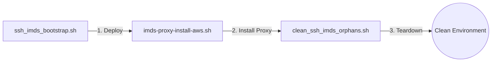
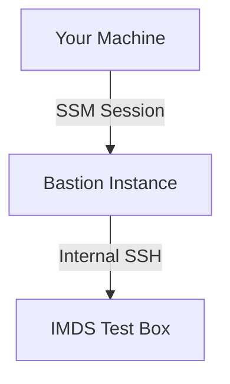

# IMDS Proxy Toolkit — Usage Guide

This toolkit consists of three scripts used to deploy, install, and tear down an AWS IMDS Man-in-the-Middle (MITM) proxy environment. The proxy intercepts EC2 metadata requests and rewrites commercial AWS region/domain values to their classified partition equivalents (**SC2S / C2S**). This allows software inside an emulated high-side VPC to function as if it were running in a classified AWS partition.

---

### Lifecycle Flow



---

## 1. ssh_imds_bootstrap.sh — Environment Deployment

Provisions the AWS infrastructure needed to reach and test the IMDS proxy. It launches two EC2 instances: a **bastion** (public IP jump host) and a private **IMDS test box**.

### Prerequisites
* AWS CLI configured and authenticated.
* `imds-proxy-install-aws.sh` located in the same directory.
* IAM permissions for EC2, Security Groups, IAM roles, S3, and Key Pairs.

### Usage
```bash
bash ssh_imds_bootstrap.sh \
  --target-vpc <vpc-id> \
  --target-subnet <subnet-id> \
  [--bastion-vpc <vpc-id>] \
  [--bastion-subnet <subnet-id>] \
  [--region <region>] \
  [--your-ip <x.x.x.x>] \
  [--key-name <existing-key-name>] \
  [--instance-type <type>]
```

### Infrastructure Created
* **EC2 Key Pair:** Saved to `./keys/<name>.pem`.
* **S3 Bucket:** `imds-proxy-scripts-<account-id>` stores installer and keys.
* **IAM Role/Profile:** `imds-proxy-role` with S3 read and SSM access.
* **Security Groups:** * `imds-proxy-bastion-sg`: SSH (22) from your IP only.
    * `imds-proxy-imds-sg`: SSH (22) from Bastion VPC CIDR only.
* **Instances:** * **Bastion:** Tagged `imds-proxy-bastion` (Public IP, SSM-enabled).
    * **IMDS Box:** Tagged `imds-proxy-imds-box` (Private IP only).

### Access Chain


---

## 2. imds-proxy-install-aws.sh — Proxy Installer

Installs the Python-based MITM proxy on the **IMDS test box**. It configures `iptables` for interception and sets up a `systemd` service.

### Usage
*Run this on the IMDS test box after bootstrapping:*
```bash
sudo bash /opt/imds-proxy/imds-proxy-install-aws.sh
```

### Technical Implementation
* **Interception:** `iptables` redirects outbound traffic for `169.254.169.254:80` to local port `8090`.
* **Request Rewriting:** Classified TLDs (`.sc2s.sgov.gov`) are rewritten to `amazonaws.com`.
* **Response Rewriting:** Commercial region strings are replaced with classified equivalents.

### Region Mappings
| Commercial | Classified Equivalent | Partition |
| :--- | :--- | :--- |
| `us-east-1` | `us-isob-east-1` | SC2S (Secret) |
| `us-east-1` | `us-iso-east-1` | C2S (Top Secret) |
| `us-east-2` | `us-isob-west-1` | SC2S West |

### Verification
```bash
# Check service status
sudo systemctl status imds-proxy

# Run Smoke Test
TOKEN=$(curl -s -X PUT [http://169.254.169.254/latest/api/token](http://169.254.169.254/latest/api/token) -H 'X-aws-ec2-metadata-token-ttl-seconds: 21600')

curl -s [http://169.254.169.254/latest/meta-data/placement/region](http://169.254.169.254/latest/meta-data/placement/region) -H "X-aws-ec2-metadata-token: $TOKEN"
# Expected Output: us-isob-east-1
```

---

## 3. clean_ssh_imds_orphans.sh — Cleanup

Safely removes all AWS resources. It performs a live inventory scan and requires **hard confirmation** (typing the Resource ID) before deletion.

### Usage
```bash
bash clean_ssh_imds_orphans.sh
```

### Deletion Order
1. **EC2 Instances:** Must be terminated first to release SGs.
2. **Security Groups:** Deleted individually via ID.
3. **IAM Resources:** Profile, Policies, and Role.
4. **Key Pair:** Local `.pem` and AWS key registration.
5. **S3 Bucket:** Deletes all contents and the bucket itself.
6. **State File:** Type `DELETE` to remove the local `.env` tracker.

> [!WARNING]
> Instances must be fully terminated before security groups can be deleted. Skipping Group 1 will cause Group 2 to fail.